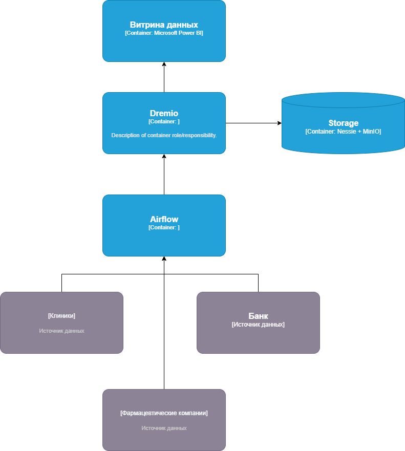

## Архитектура через год

Данные из всех фармацевтических компаний, клиник и банка должны собираться в одном DataLakeHouse.

## Проблемные места:

Все компании имеют разные системы для хранения данных, приведение к общему знаменателю может занять много ресурсов.
Объёмы данных будут очень большими и быстро расти. Хранилище данных должно быть распределённым, сать данных можно хранить в публичном облаке, часть на собственных серверах.

Для аналитики данных может потребоваться выбор новой системы, но для начала оставим Power BI как наиболее привычное решение

## Приоритизация по системе MoSCoW 

| Приоритет | Проблема |
|---|-------------|
|Must have |  Интеграция с внешними системами источников данных |
|Should have |  Распределённое хранилище данных |  
|Could have |  Новая аналитическая система |