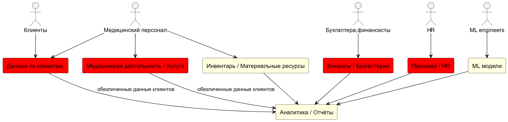

## Разделение данных по доменам

- Клиенты / Пациенты
    - Данные по клиентам.
- Медицинская деятельность / Услуги
    - Медицинские карты и истории болезни, в том числе — данные исследований, выполненных в ходе лечения.
- Финансы / Бухгалтерия
    - Финансовая история.
    - Счета.
    - Данные о кредитах.
- Персонал / HR
    - Данные по персоналу больницы.
- Инвентарь / Материальные ресурсы
    - Данные по инвентаризации.
- Аналитика / Отчёты
    - Финансовая отчётность 
- ML модели
    - Результаты ИИ иследований

Данные в доменах требуют разного уровня обеспечения безопасности, имеют разные источники и темп обновления.

Таким образом легче настроить доступ к этим данным, настроить разные системы хранения и бэкапа.

