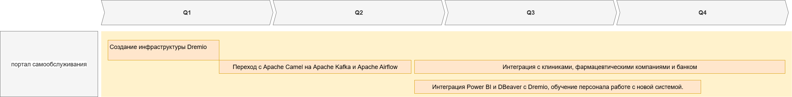

## Технический радар

| Ring  | Quadrant | Title                     |
|-------|----------|---------------------------|
| Стратегические технологии  | архитектура данных   | Microsoft SQL Server 2008 |
| Стратегические технологии | интеграции    | Power BI                  |
| Устаревшие   | интеграции    | PowerBuilder              |
| Потенциальные   | интеграции    | DBeaver              |
| Устаревшие | интеграции    | Apache Camel              |
| Потенциальные   | интеграции     | Apache Kafka              |
| Стратегические технологии | языки программирования и фреймворки | ML Services on Python     |
| Стратегические технологии | языки программирования и фреймворки | Golang                    |
| Стратегические технологии | языки программирования и фреймворки | Java                      |
| Потенциальные | архитектура данных | Dremio |

## Roadmap

Сначала требуется создать инфраструктуру для централизованного сбора данных.
Затем нужно приступить к подготовке ETL механизмов.
Следующий этап это интеграция каждого предприятия с новой системой сбора данных
Параллельно нужно начать обучение сотрудников работе с новой системой у них уже будет возможность анализировать реальные данные в 